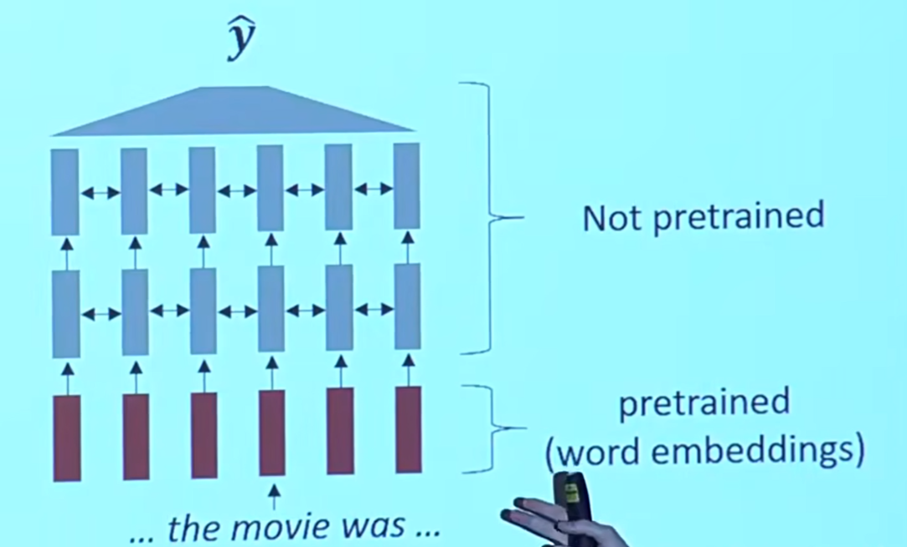
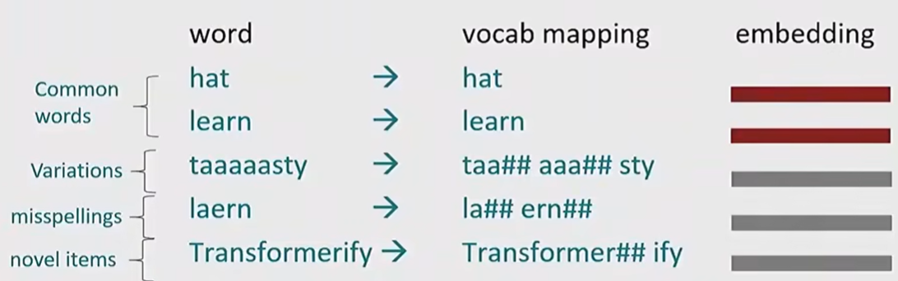
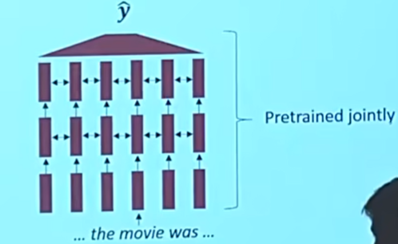
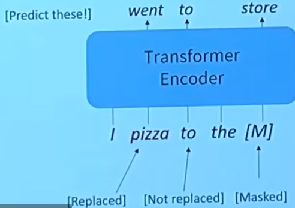
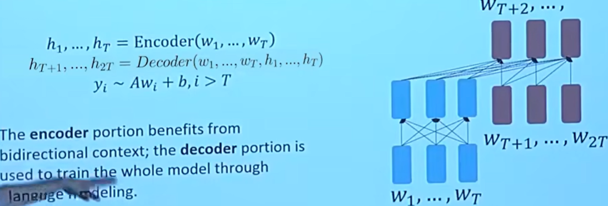

# Lecture 10 - Transformer and Pretraining

预训练会将单词转化成word embedding，但不是只能在embedding层使用

对于训练集中的单词，会在预训练的过程中进行映射。而一些没有在字典中出现的词，例如taaaaasty, laern, Transformerify这样一些拼写错误或者较为特殊的表达，则会被映射到**UNK**

### Byte-pair Encoding Algorithm

Subword Modeling是一堆关于比单词更小的结构的NLP处理方法

其中，Byte-pair Encoding Algorithm(BPE)的工作步骤如下：

1. 初始化：最初，数据集或词汇表的中的每个字符被视为一个标记（标记可能是单个字符、子词或单词，这是由不同的粒度设置决定的）
2. 配对统计：算法迭代地计算数据集中标记对（通常是相邻字符或子词）的频率（比如记录"hello"中的"he","el","ll","lo"）
3. 合并：将最频繁出现的标记对合并成一个单一标记，并加入到词汇表中
4. 迭代：重复执行步骤2和3，知道满足设置迭代次数或某个条件为止

当然，一些本身就是完整有意义单词的，不需要分割处理，如下图：

但是在之前的过程中，做word embedding并没有考虑到上下文

### Pretrain

现代NLP中，所有网络中的参数都通过预训练来初始化。预训练会将模型输入的部分隐藏起来，并训练模型去重建这些部分：

### Pretrain and finetuning

Pretrain：从大规模未标记的数据中提取有用特征的表示。这个过程旨在捕捉语言中的普通模式和关系，而不针对特定的任务

finetuning：预训练后的模型被用于特定任务的小规模数据集上，进一步调整模型参数

### Model pretraining 3 ways：

关于这三种方法的一些关键点：

- Decoders
  - 上文说的的预训练方法
  - 可以预测，但是无法根据未来的单词进行预测
- Encoders
  - 可以双向获取上下文，可以从未来获取并进行预测
  - 但是怎么预训练呢？（因为可以看到未来，那么损失函数为0）
- Encoder-Decoders
  - 可以集decoder和encoder的优点于一体？
  - 但是什么方法可以很好地预训练呢？

#### Pretraining Decoders——GPT(Generative Pretraining Transformer)

只能获取当前预测位置之前位置的词信息

#### Pretraining Encoders——BERT

能够看见双向的上下文，但是会通过Mask Language Model来让模型完成任务，进而完成预训练

而mask分为三种，如下图：masked, replaced, not replaced。且模型并不知道哪些词被替换了或者只是被简单地掩盖了，所以需要进行预测，通过这种方法来进行预训练

但是Pretraining Encoders并不能很好地完成生成序列，即需要每次生成一个单词这样的任务（更适合用Decoder来做）

#### Pretraining encoder-decoders

