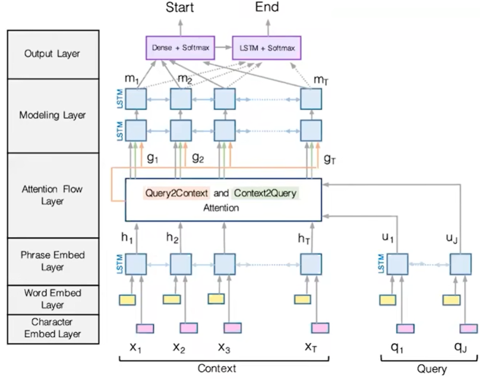
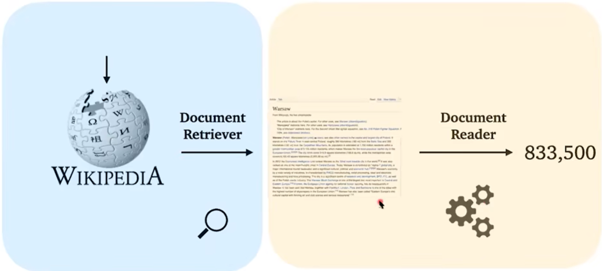

# Lecture 11 - Question Answering

### Bidirectional Attention Flow Model(BiDAF)

整体架构如下图

#### Phrase Embedding Layer:

其中，Phrase Embedding是由Word Embedding和Character Embedding向量连接起来的（向量直接连接）

#### Attention Flow Layer:

由两类Attention组成：

- Context2Query Attention：对于每个context中的词，去query里面找到最相近的那个词
- Query2Context Attention：在context中选择和query中的词最相近的词

具体过程：首先引入context中的向量c~i~ 和 query中的向量q~j~

- 首先计算每对(c~i~, q~j~)的相似score
  $$
  S_{i,j} = w^{T}_{sim}[c_{i};q_{j};c_{i}⊙q_{j}]∈R，w_{sim}∈R^{6H}
  $$

- 然后是Context2Query Attention（拿着context，去query里面找，所以softmax乘q~j~）
  $$
  α_{i,j}=softmax_{j}(S_{i,j})∈R
  $$

  $$
  a_{i}=∑ ^{M}_{j=1}α_{i,j}q_{j}∈R^{2H}
  $$

- 然后是Query2Context Attention（拿着一些query词，去context里面找，所以softmax乘c~i~）
  $$
  β_{i}=softmax_{i}(max_{j=1}^{M}(S_{i,j}))∈R^{N}
  $$

  $$
  b_{i}=∑ ^{N}_{i=1}β_{i}c_{i}∈R^{2H}
  $$

- 综上，最终该层的输出为：
  $$
  g_{i}=[c_{i};a_{i};c_{i}⊙a_{i};c_{i}⊙b_{i}]∈R^{8H}
  $$

#### Modeling Layer

在Modeling Layer中有两层双向LSTM。该层的主要作用就是将g~i~传递给这两层双向LSTM

和Attention Layer相比：

- Attention Layer是在query和context之间构建联系

- Modeling Layer是在context的词之间构建联系（如下图），且每一层LSTM中使用的向量是：
  $$
  m_{i}=BiLSTM(g_{i})∈R^{2H}
  $$

#### Output layer

两个预测开始和结束位置的分类器，如下图：
$$
p_{start}=softmax(w^{T}_{start}[g_{i};m_{i}])
$$

$$
p_{end}=softmax(w^{T}_{end}[g_{i};m^{’}_{i}])
$$

其中：
$$
m^{'}_{i}=BiLSTM(m_{i})∈R^{2H}；w_{start},w_{end}∈R^{10H}
$$
最终的训练损失：
$$
L=-logp_{start}(s*)-logp_{end}(e*)
$$

### BiDAF and BERT Models

BiDAF和BERT的不同之处在于：

- BiDAF和其他模型致力于构建question和passage之间的联系
- BERT在question和passage的连接之间使用了self-attention = attention(P,P) + attention(P, Q) + attention(Q,P) + attention(Q,Q)

### Open-domain question answering

之前谈到的QA都是建立在有某段固定文段上的。而Open-domain question answering则没有给定一个文段，而是将一个大的文档集合中作为根据（e.g：维基百科）

#### Retriever-Reader framework

Retriever负责从大规模语料中找出相关的文段，Reader负责去这些文段中提取答案信息

具体过程：

- Input：一个大型文档集合 D = D1, D2, ..., DN and Q
- Output：一个答案字符串 A

那么Retriever和Reader的过程：

- Retriever：f(D,Q) —> P1, ..., PK
- Reader：g(Q, {P1, ..., PK}) —> A

抽象来说，两部分做的事：

- Retriever是一个标准的TF-IDF用于信息提取的稀疏模型
- Reader是上面一直提到的神经阅读理解模型