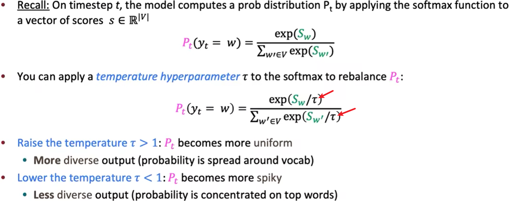
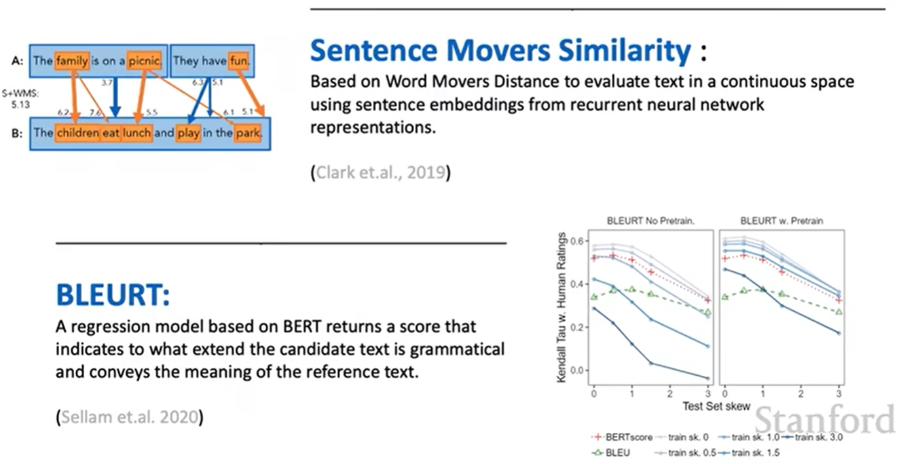

# Lecture 12 - Natural Language Generation(NLG)

Natural Language Generation是一个NLP的子领域。

NLG聚焦于建立一个自动生成连贯且有意义的文本或语音的系统

### Formalizing NLG: a simple model and training algorithm

使用的推断函数和用于训练的损失函数如下图：

### Decoding from NLG models

会出现重复生成的行为，如下图。而且随着重复的次数越多，模型会越来越确信这个重复的内容是对的（因为它的最小对数似然越来越小，说明P()越来越大）

解决方案：在Decoding时采用**Top-k sampling**：

只采样分布概率可能性排前k个的单词

- k越大，就会更多样性，但也会具有风险
- k越小，就会更泛化，但内容更正常

#### Scaling randomness: Softmax temperature

通过给Softmax中的exp()参数同时乘以一个temperature超参数，就能调整概率分布：

其中，如果 

- τ大于1，那么概率分布会更分散平滑，输出就更加多样化
- τ小于1，那么概率分布会更集中陡峭，输出就更加专注化

#### Improving decoding: re-balancing distributions

通过短语后跟着的单词，将相关频率添加到原来的频率分布中，让分布更合理

#### Backpropagation-based distribution re-balancing

#### Improving Decoding: Re-ranking

如果生成了一个坏sequence怎么办？

解决方案：生成一批sequences，然后使用一个score来重新排名他们的分数

- 最简单的score就是perplexity
- ...

### Training NLG models

首先所有probability的负对数似然的总和最小，这是一个有效的训练方法。但是容易出现重复的问题

#### Unlikelihood Training

为了避免相对通用语言减少模型生成结果多样性的问题，该训练方法引入负面样本来调整模型。

计算一个unlikelihood probability，并和之前的likelihood进行权重求和。

#### Exposure Bias

在最大似然训练过程中，每一timestep的输出又作为输入进入下一步，因此，后面的生成结果是受前面的概率分布的影响的，这就是Exposure Bias

解决方法：

- Sequence re-writing：从现有语料库或者人类语言原型中取回一些序列，并对这个序列进行增删改查 
- Reinforcement Learning：通过对模型的奖励机制来进行学习，Reward越高，下次在这个context中该词的probability越高。用作Reward算法的有BLEU等。当然，要对Reward有一个baseline
  - State **s** 是模型对于前面文本的呈现
  - Actions **a** 是能被生成出来的词
  - Policy **Π** 是decoder
  - Rewards **r** 是由一个外界score提供的

### Evaluating NLG Systems

#### Content overlap metrics

计算生成的文本和gold-standard(参考文本)的显式相似度。这种方法快且有效，其中有两种实现的策略：

- N-gram overlap metrics(e.g: BLEU, ROUGE, METEOR, CIDEr, etcs.)
  - 对于机器翻译、对话这些场景来说不太理想，因为有多种方法可以翻译（open-ended）
- Semantic overlap metrics(e.g: PYRAMID, SPICE, SPIDEr, etc.)

#### Model-based metrics

通过神经网络，语义相似度的判断来评估。

- Word distance functions

  

- Beyond word matching

  

#### Human evaluations

NLG的最终度量还是与人类交互的过程中的效果

### Ethical Considerations

