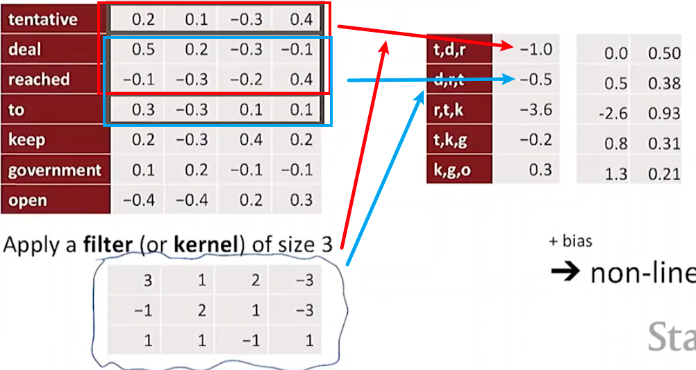
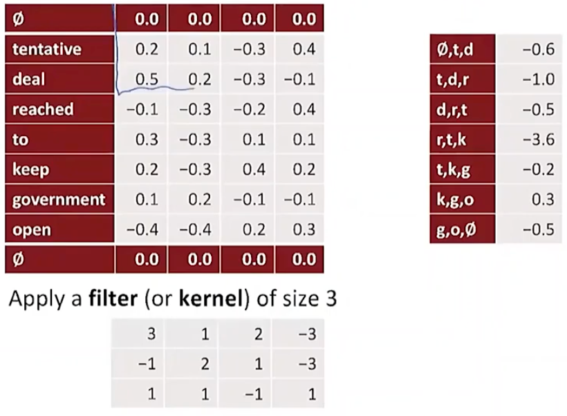
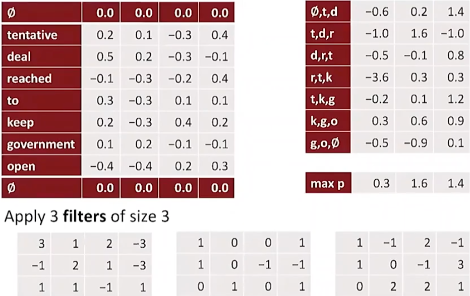

# Lecture 13 - Coreference Resolution

### What is Coreference Resolution

识别指代同一个实体的词

应用：

- Full text understanding
- Machine translation
- Dialogue Systems

Coreference Resolution步骤

1. Detect the mentions(easy)
2. Cluster the mentions(hard)

### Rule-based (Hobbs Algorithm)

通过手写的方式来总结一些规则

### Mention-pair and mention-ranking models

#### Mention-pair

mention-pair是在文中同时出现的相关mention

在训练时，通过常规交叉熵损失来计算，其中，如果mention i和j是Coreferent，那么y~ij~为1，反之为-1。计算后通过设置一定的阈值来确定coreferent link，然后对所有coreferent links进行传递闭包操作，得到最终的cluster

不足：

- 对于出现的coreferent错误很敏感，因为有求闭包的操作
- 如果给定的是一个很长的文段或者文档，对于分类器来说要把coreferent分到一起基本不太可能

#### Mention Ranking

1D convolution for text：将三个单词的值作为一个窗口，和filter共同进行处理之后，得到一个新的值，再加上bias，再非线性化。处理完三个词后，窗口往下滑动一格，如下图：

1D convolution with padding：在输入的两边都加一行空，使得输出数量与有效输入数量相同：

1D convolution, padded with max pooling over time：在前面的基础上加一个在输出中出现的最大值

### Current state-of-the-art neural coreference systems

#### End-to-end Model

End-to-end model 是一个mention ranking model，在简单的前馈神经网络中使用了LSTM、注意力和mention detection

具体步骤：

1. 首先用词向量矩阵和一个字符级别的CNN将文档中的单词做嵌入

2. 然后使用一个双向LSTM

3. 将每段文本 *i* 从start(i)到end(i)的span表示为一个向量

   .png)

   其中x^^^~i~是以注意力为权重的span中的词嵌入平均值，表示方法如下图

   .png)

4. 最后计算每个span对，判断它们是否coreferent

   .png)

