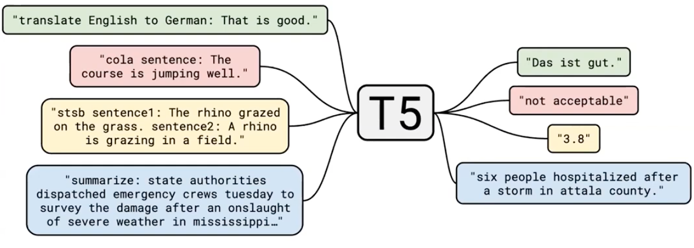

# Lecture 14 - T5 and Large Language Models

### T5

利用迁移学习，T5能够用同一个模型以及相同的学习率优化器，完成不同的下游任务

通过一堆数据对比，得到了T5的5个设计理念：

- Encoder-Decoder architecture
- Span prediction objective
- C4 dataset
- Multi-task pre-training
- Bigger models trained longer

### mT5

可以进行各种语言任务