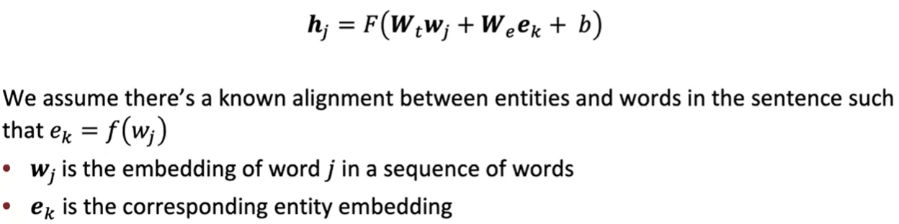

# Lecture 15 -  Add Knowledge to Language Models

尝试用Language Model来代替传统的知识库Knowledge base(KB)

#### Advantages of language models over traditional KBs

- LM是在大量非结构化和未标记的文本上进行预训练的
  - 而KB需要人工标注或者是复杂的NLP方法
- LM支持更灵活的自然语言查询

但是将LM作为KB也有一定的挑战：

- 更难解释、信任和修改

### Techniques to add knowledge to LMs

#### Add pretrained entity embeddings

世界是由实体构成的

将单个词嵌入，通过各种语境，将实体连接起来，获得Entity Embeddings。而这个过程，也说明实体和文本是相关的。

Entity Embeddings适合Word Embeddings类似的，但是Entity Embeddings是用在知识库里的

将知识加入到LM的几种方法：

- Add pretrained entity embeddings

  通过fusion layer的方式将上下文和实体信息合并

  

  - ERNIE: Enhanced Language Representation with Informative Entities
    - Text encoder：基于语句中的word的多层双向Transformer encoder。包含：
      - 基于entity embeddings和token embeddings的两个Multi-headed attentions(MHAs)
      - 合并MHAs输出的fusion layer
    - 预训练的三个任务：（预训练损失就是这三部分加和）
      - Masked Language Model 和 Next Sentence Prediction
      - Knowledge Pretraining Task (dEA)：随机遮盖一对token-entity对齐关系，并且从语句中的实体中预测这个token对应的entity
    - 优点：
      - 通过fusion layer和knowledge pretraining task，将entity和context信息融合
      - 在知识驱动任务上改善下游表现
    - 挑战：
      - 需要带有实体标记的文本数据
      - 需要更多的预训练
    
  - KnowBERT
    
    主要思路：预训练一个integrated entity linker(EL)作为BERT的扩展
    
    - 它的损失函数是next sentence prediction + masked language model + **entity linker**
    - 在下游任务上，EL直接预测entity，所以就不需要提前标注entity了

- Use a external memory

  因为之前的方法都依赖于预训练知识库，所以需要修改知识的话，就需要重新训练太麻烦。所以尝试让模型能够访问一个外在存储。

  优点：能更好地支持注入或者更新事实知识，甚至是不用更多的预训练；可解释性更强

  - KGLM(Knowledge Graph LM)

    主要思路：在知识图上调整语言模型

    - 构建一个基于序列的local KG（是完整KG的一个只有与序列相关实体的子集）
    - 使用LSTM的隐藏状态来预测下一个词的类型（三类：在local KG中的Related entity、不在local KG中的New entity、不是entity）
    - 然后通过三元组(parent entity, relation, tail entity)
      - 如果是Related entity：找出local KG中得分最高的parent entity和relation，然后下一个实体就是tail entity，然后再通过词汇库得到对应的word
      - 如果是New entity：找出full KG中得分最高的parent entity和relation
      - 如果是Not a entity：最可能是标准词汇库的下一个token

  - kNN-LM(k Nearest Neighbor-LM)

    主要思路：学习文本序列之间的相似度比预测下一个word要简单，所以将所有文本序列的表示都存储在最近的数据仓库中

    - 找到数据仓库中k个最相似的序列
    - 取回k个序列对应的值
    - 将kNN可能性和LM可能性合并作为最终的预测

- Modify and training data

  通过非结构化文本隐式地合并知识

  优点：没有额外的存储/计算的要求；没有特定模型修改

  - WKLM (Weakly Supervised Knowledge-Pretrained LM)

    主要思路：训练模型来辨别真knowledge和假knowledge，将真knowledge中的实体更换为相同类型的其他实体，变成negative mention

    损失函数：是masked LM的损失（定义在token层次）和entity replacement损失的加和（定义在entity层次）

  - ERNIE(another!), salient span masking