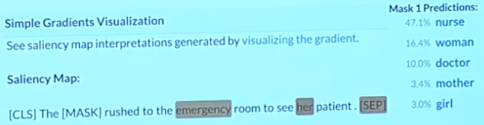

# Lecture 17 - Model Analysis and Explanation

### One model at multiple levels of abstraction

有非常多样化的方式来分析模型。首先要明确想从哪个层次的抽象来分析模型

### Out-of-domain evaluation sets

#### Testing for linguistic knowledge

在测试时给出两个非常相似的句子，一个句法正确，另一个句法错误

将这两个人工判别过的句子给模型，并且将更高的概率分配给那个正确的语句

### Influence studies and adversarial examples

#### What part of my input led to this answer

使用saliency maps，可以展示每个输入词对于模型预测的重要性分数

下图中高亮的词就是预测的关键词

制造一个saliency map的方式：

- Simple gradient method

### Analyzing representations

#### Probing studies: supervised analysis

使用探针放在神经网络中的每一层，去检测它的具体表示，

### Revisiting model ablations as analysis

