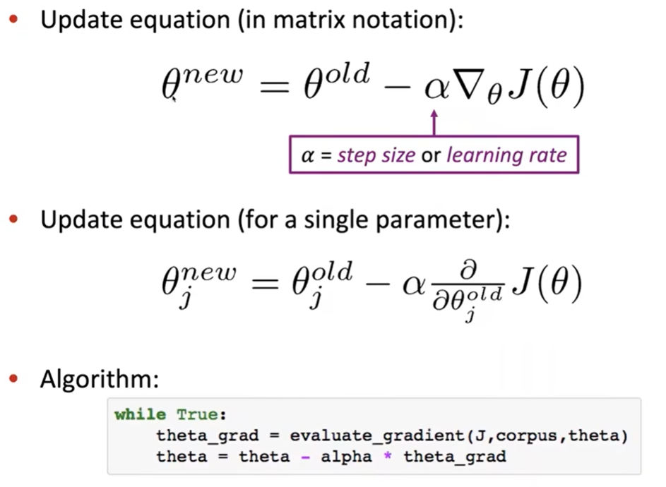
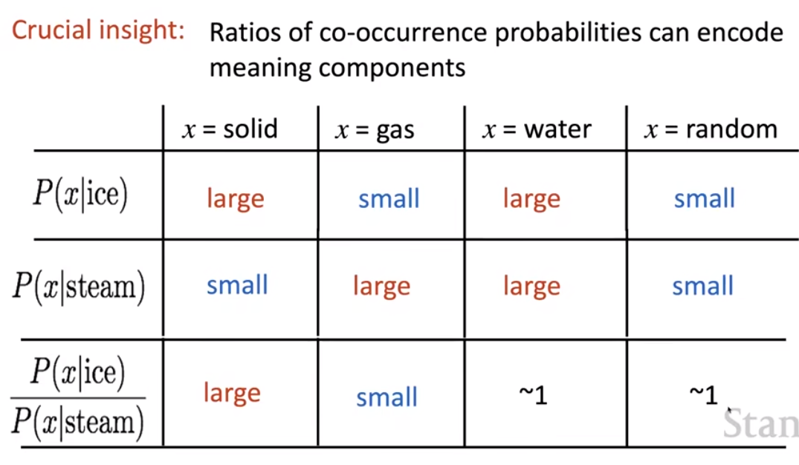

# Lecture 2 - Neural classifiers

### Optimization: Gradient Descent

Lecture 1 中提出了 cost function--`J(θ)`，为了学习好的词向量，要尽可能让 J(θ)小。

采用梯度下降算法 Gradient Descent：沿着梯度的反方向移动

但是基于语料库的大量数据，进行严格梯度下降成本太高

采用随机梯度下降 Stochastic Gradient Descent，区别在于：**标准梯度下降**是在权值更新之前对所有样例汇总误差（有求和操作）；而**随机梯度下降**是考查某个训练样例

词向量都是行向量（因为这样可以将其作为连续的内存范围）

### Word2vec algorithm family:

两个模型 Two model variants:

- Skip-grams(SG)：根据给定中心词，预测上下文
- Continuous Bag of Words(CBOW)：根据上下文预测中心词

之前使用的 naive softmax 训练方法，简单但是昂贵

sgns：skip-grams negative sampling

- 主要思路：针对一个真正的词向量对（中心词和另一个在其窗口中的上下文词语）训练二元逻辑回归 vs. 几个噪声词对（中心词和另一个随机词）

### GloVe

男性->女性 ---> 国王->皇后

会更加偏向于意义上的转换，而相同的意义部分则会抵消

### Evaluate word vectors

NLP 的普遍评估方法：内在评估 Intrinsic vs. 外在评估 Extrinsic

- Intrinsic：在一个具体的子任务上评估
- Extrinsic：在一个真正的任务上评估
