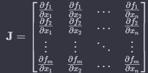
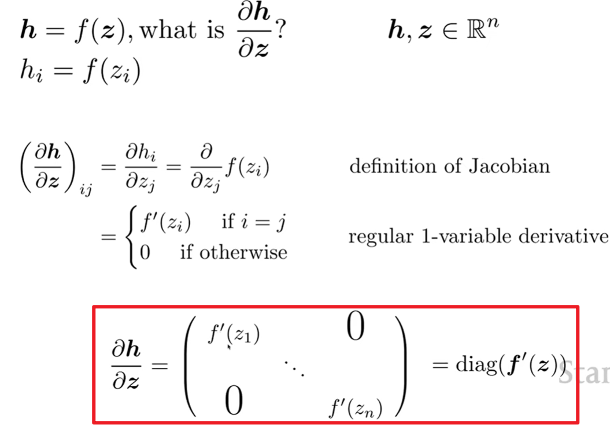
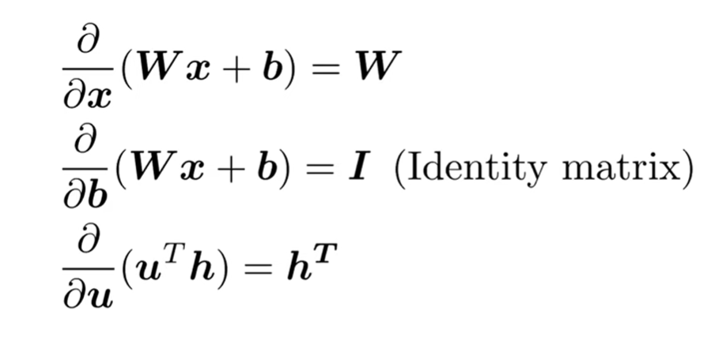
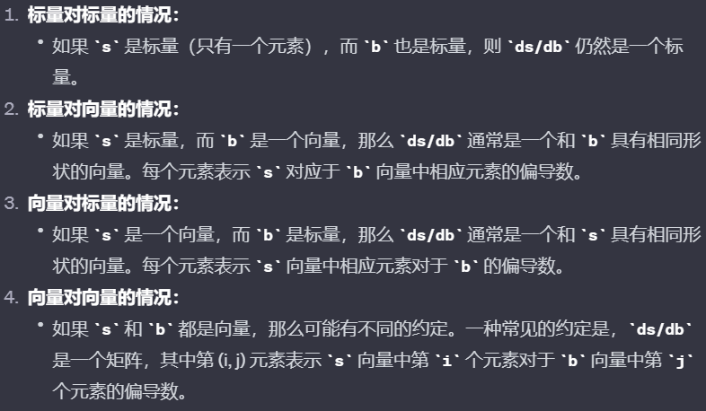
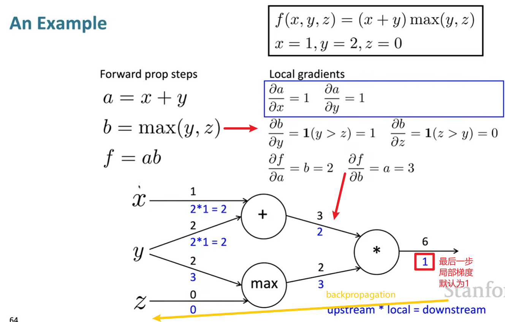

# Lecture 3 - Backprop and Neural Networks

### Named Entity Recognition (NER)

进行标注

### Elementwise activation function逐元素激活函数

逐元素激活函数：激活函数对输入中的每个元素都独立地进行操作，而不是对整个输入向量或矩阵进行操作

逐元素激活函数包括：

- Sigmoid函数：f(x) = 1/(1+e^-x^)。对于输入中的每个元素，它将输入的范围映射到 (0, 1)。 
- Softmax函数：对于输入向量中的每个元素，它将其指数化并归一化，产生一个概率分布

Jacobian： 在多变量微积分中，Jacobian矩阵表示矢量值函数相对于其输入变量的变化率。如果有一个矢量值函数f**(**x)=[*f*1(**x**),*f*2(**x**),…,fm(**x**)]，其中 **fx** 是输入变量的向量，那么Jacobian矩阵，用 **J** 表示，定义为： 



一些Jacobian矩阵偏导的例子：

- 
- 

shape convention 形状约束：



*在求偏导的链式法则中，存在多层偏导结果。结合Jacobian只对一个变量求偏导的思想，可以重复利用高层的偏导结果，来节省计算


### Backpropagation

正向传播Forward Propagation：从最底层，即输入开始，一直推算到最高层结果

但是，为了模型的学习能力，在我们使用正向传播时，每一次就会向后反转，并将梯度结果传播到底层的参数上，方便即使调整。这就是**Backpropagation**

并且在反向传播的过程中，利用上层的梯度结果，节省计算，即：

```
[downstream gradient]=[upstream gradient]x[local gradient]
```

一个backpropagation例子：



p.s: 其中，df/dy 梯度是2+3（y作为多边输入）