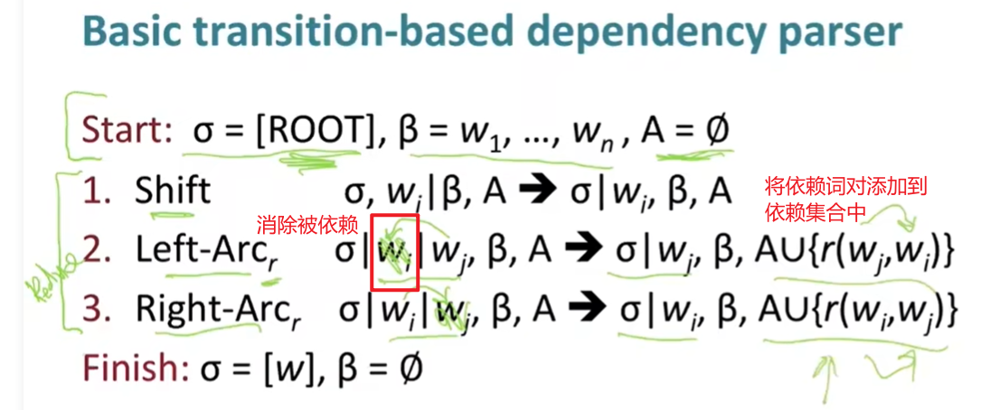
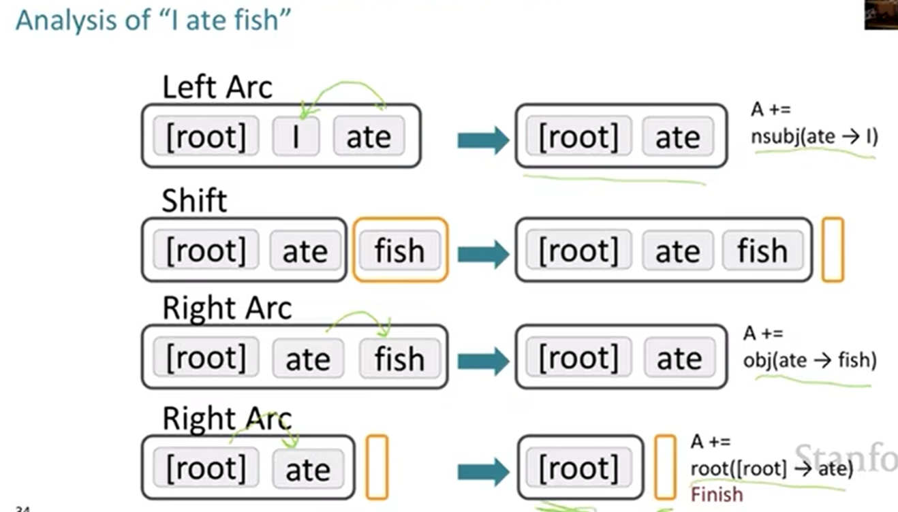

# Lecture 4 - Dependency Parsing

### Dependency structure

依存语法中，句法结构被表示成词语之间的二元关系，其中一个词是“头head”，另一个词是它的“从属dependent”

e.g: by the door。by就是door的从属

​		look in the crate。crate也是look的从属

 在具体表示中，箭头从head指向dependent

### Dependency Parsing

如下图，通过依赖关系，可以将推导式中的词减少，将依赖词对加入到依赖集合中

完整的shift-reduce过程：

