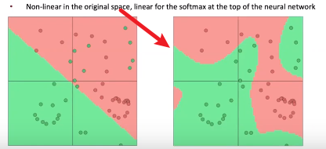
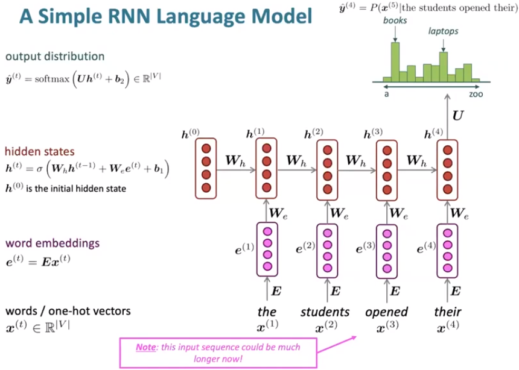

# Lecture 5 - Language Models and RNNs

### Classifiers in Deep Learning

深度学习中的分类器是非线性的，如下图

即使是softmax classifier，也只有在最顶层是线性的softmax classifier，在下面的有其他神经网络层，能扭曲空间而使最终呈现变成非线性



### Regularization

如下图是一个带有正则项参数的新损失函数，当我们试图最小化该函数时，一方面要让原来的softmax回归部分最小化；另一方面，每个w不能太大，否则正则项(也被称为惩罚项，用来惩罚各个w过大导致的模型过于复杂的情况)就会很大。正则项中的λ是用来平衡损失函数和正则项之间的系数，系数越大，正则项的惩罚效果越强


一个更加一般化的定义：

```
minimize(Loss(Data|Model)) + λxComplexity(Model)
```

正则化系数λ努力平衡训练数据的拟合程度和模型本身的复杂程度：

- 如果正则化系数过大，模型可能比较简单，但是有欠拟合的风险。模型可能没有学到训练数据中的一些特性，预测时也可能不准确。
- 如果正则化系数过小，模型会比较复杂，但是有过拟合的风险。模型努力学习训练数据的各类特性，但泛化预测能力可能不高。
- 理想的正则化系数可以让模型有很好的泛化能力，不过，正则化系数一般与训练数据、业务场景等具体问题相联系，因此需要通过调参找到一个较优的选项。

补充一个过拟合的示意图：(尽管并不关心模型在训练数据上是否有过拟合现象)


### Parameter Initialization

初始化神经网络矩阵时要用小的非零随机值

### Language Modeling

**Language Modeling** is the task of predicting what word comes next

### n-gram

n-gram: a chunk of n consecutive words。适用于没有神经网络的时期，学习语言模型

条件概率计算方式如下：


n-gram语言模型的一些Sparsity Problems：

- 问题：如果某个w对应的"students opened their w"从来没有在数据中出现过，那么它对应的可能性将会是0

  解决方案：给每一个w的count值加上一个小的增量，让它非零，这种方法叫**smoothing**

- 问题：如果"students opened their"没有在数据中出现过，那甚至连条件概率都不能计算了

  解决方案：缩短n，使用"opened their"作为分母再进行尝试，这种方法叫**backoff**

注意：n越大，sparsity problems会更严重。因此，n不能大于5

n-gram语言模型的一些Storage Problems：

- 问题：没有神经网络的情况下，语言模型进行预测时需要存储所有的条件概率值，规模太大

### A fixed-window neural Language Model

 模型示意图和优劣如下图：


### Recurrent Neural Networks(RNN)

关键点在于：重复使用相同的权重W


一个简单的RNN语言模型层次架构：



该模型对应的优劣：

.png)