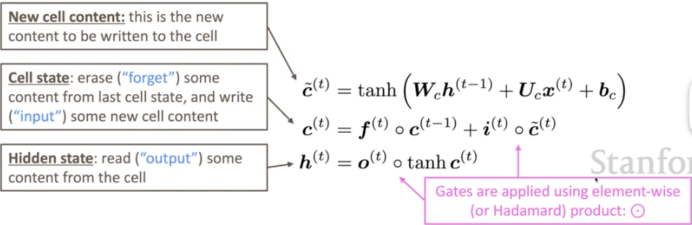
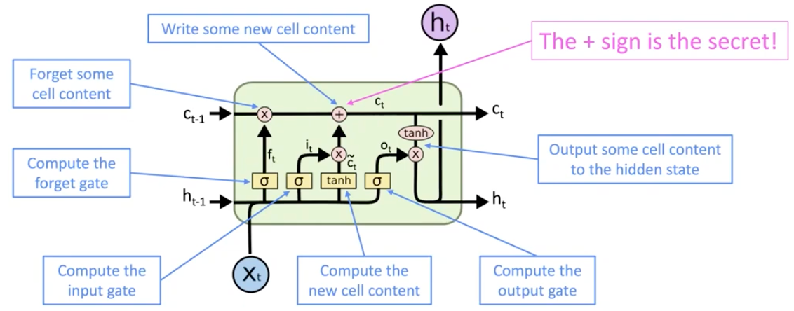

# Lecture 6 - Simple and LSTM RNNs

### RNN-LM Training

训练步骤：

1. 有一个足够大的文本语料库，其中是单词序列x(1),...,x(T)

2. 将语料喂给模型，对每一步t都计算output distribution yˆ(t)

3. t步骤上的损失函数是“预测概率分布”yˆ(t) 和 “真正下一个词的概率”y(t)(即one-hot for x(t+1)) 的**交叉熵**
   $$
   J^{(t)}(θ) = CE(y^{(t)},y\^^{(t)}) = -∑_{m∈V}y_{w}^{(t)}log y\^_{w}^{(t)} = -log y\^_{x_{t+1}}^{(t)}
   $$

4. 对这个损失函数求平均以获得整个训练集的全局损失
   $$
   J(θ) = 1/T∑^{T}_{t=1}J^{(t)}(θ) = 1/T∑^{T}_{t=1}-logy\^_{x_{t+1}}^{(t)}
   $$

调参需要用到梯度下降，而总的梯度就是由每一步的梯度累加起来的，即
$$
δJ^{(t)}/δW_h = ∑^{t}_{i=1}δJ^{t}/δW_{h} |_{(i)}
$$

### LM Evaluating

语言模型的标准评估度量是**perplexity**，这个值相当于通过平均的方式求出下一个词正确的概率的倒数是多少，这个值**越小越好**（因为是倒数）
$$
perplexity=∏^{T}_{t=1}(1/P_{LM}(x^{(t+1)}|x^{(t)},...,x^{(1)}))^{1/T}
$$
语言模型是许多NLP任务的一部分，尤其是那些包含*文本生成*或者*估计文本概率*的任务

### Vanishing and Exploding Gradient

Vanishing gradient problem：在RNN的反向传播中，当每一步的梯度都很小，那么在反向传播的过程中，用链式法则累乘的梯度就是越来越小。这样就会使比较远的梯度信息丢失，通过它们进行学习的效果会很弱。
造成这个问题的**主要原因**是RNN很难在经过很多步隐藏状态之后还能保留之前的记忆。解决方案：

- LSTMs(Long Short-Term Memory RNNs)

Exploding gradient problem：如果梯度变得很大，那再通过学习率乘上梯度，参数就可能一下调整到很远的地方，从而造成很坏的调参结果。解决方案：

- Gradient clipping：如果梯度的标准比一些门槛阈值还高，那就在SGD之前把梯度标准降低。不改变下降方向，但是减小步长

### LSTMs(Long Short-Term Memory RNNs)

LSTM：在每一步隐藏状态中，不只构建一个向量，而是在每一步构建两个向量：hidden state——**h**(t)和cell state——**c**(t)

- 两个都是长度为n的向量
- cell存储长期信息
- LSTM能从cell中读取、擦除和写入信息（cell就像计算机中的RAM一样）

而对擦除/写入/读取哪条信息的选择是由三个对应**gates**来控制的

- gates也都是长度为n的向量
- 对于每一步来说，gates的每个元素都可以**打开(1)**、**关闭(0)**或者介于**二者中间**的值
- gates是**动态**的：他们的值是基于当前上下文来计算的

gates一共有三个，他们的计算方式都和简单RNN的计算方式一样（sigmoid函数用来保证gates的值分布在0和1之间）
$$
f/i/o^{(t)}=σ (W_{f/i/o}h^{(t-1)}+U_{f/i/o}x^{(t)}+b_{f/i/o})
$$

- forget gate：控制是否从cell中擦除信息，防止过时信息干扰网络学习
- input gate：控制是否更新cell的内容，允许新的信息进入cell
- output gate：控制cell的输出，即当前timestep的隐藏状态

加入cell之后相关量的计算公式如下图：

整个计算过程可以这样抽象：

LSTM架构能够让RNN更容易保留信息，尽管通过了很多步timesteps