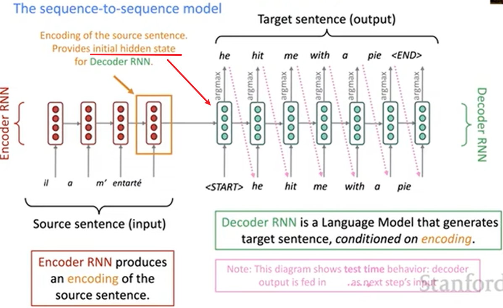
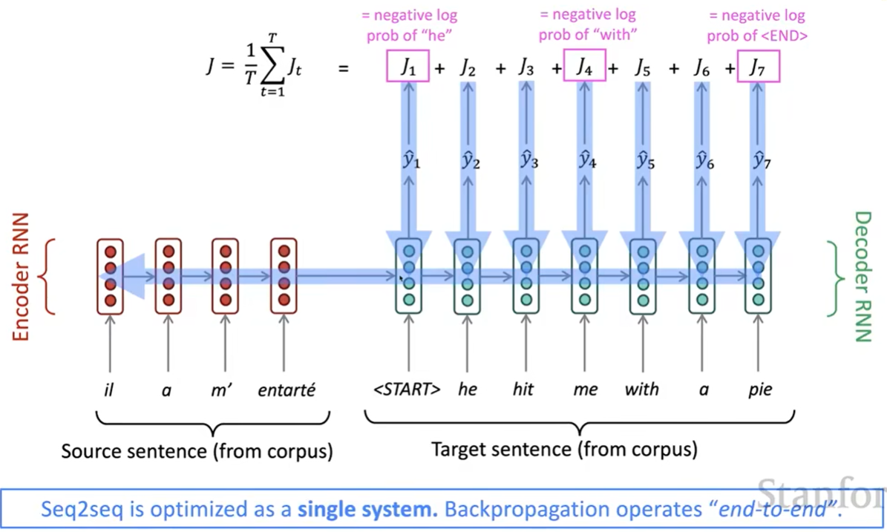
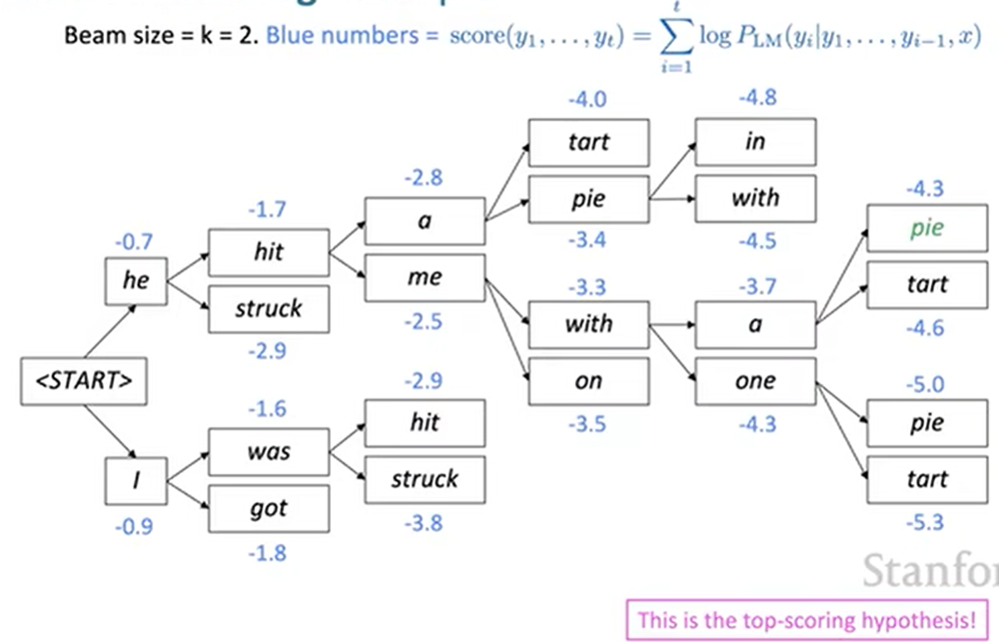
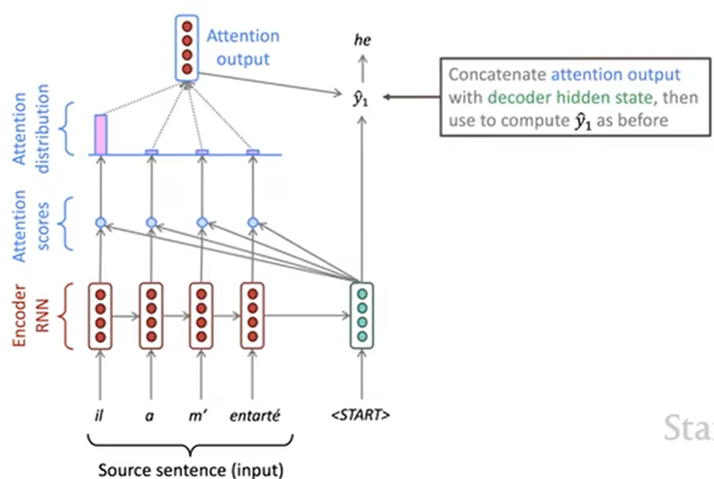

# Lecture 7 - Translation, Seq2Seq, Attention

### Neural Machine Translation(NMT)

NMT是一种使用单个端到端神经网络进行机器翻译的方法

上述神经网络被称为**seq2seq**模型，其中包含两个RNNs: encoder和decoder

seq2seq过程示意图：

### NMT Training

首先是要有一个平行语料库

然后通过decoder的损失函数加和，来同时优化encoder和decoder，如图：

### Multi-layer RNNs

之前学到的RNN都是一层结构，然后水平沿timestep展开

现在可以构建多层RNNs，以此来计算更复杂的表示：低层RNNs计算低级特征，高层RNNs计算高级特征

Multi-layer RNNs也被称作stacked RNNs，比单层表现更好

### Decoding

#### Greedy Decoding

定义：如同上面Seq2Seq的流程（图1）一样，Decoder中每一次隐藏状态选取出来的都是probability最高的单词

问题：这个流程中的步骤是无法撤销的，且每一步都是局部最优解，极有可能是**非全局最优的**

#### Exhaustive search decoding

为了解决greedy decoding的问题，理想状态下，应该计算所有的可能句子，但是的复杂度太昂贵了

#### Beam search decoding

主要思路：在Decoder的**每一步**，都跟踪k个最可能的翻译结果（被称为hypotheses）

- 其中k被称为beam size（一般大小在5到10之间）

一个hypothesis: {y1,...,yt} 有一个对应的可能性对数值，称为**score**
$$
score(y_{1},...,y_{t}) = logP_{LM}(y_{1},...,y_{t}|x) = ∑^{t}_{i=1}logP_{LM}(y_{i}|y_{1},...,y_{i-1},x)
$$

- 所有的scores都是复数，所以score越大越好
- 在其中找到高score的hypotheses

Beam search decoding不能保证找到最优解，但是效率一定比Exhaustive search decoding要高

Beam search decoding过程：(记住每一步都只取k个可能)

而与Greedy不同的是：Greedy会在\<END\>结束生成；但是Beam的\<END\>可能会出现在不同地方，所以可能造成不同的hypotheses的长度不一样，就会带来下面的问题

问题：更长的hypothesis分数会更低

所以应该要根据长度进行标准化：
$$
score/t（t是hypothesis的长度）
$$

### NMT Evaluation

BLEU(Bilingual Evaluation Understudy)：对于同一个源句，将NMT翻译的结果和几个人工翻译的结果放一起，基于n-gram precision计算他们的similarity score

### Attention

bottleneck problem：对于Seq2Seq来说，代表源句的意义的就是Encoder中最后那个隐藏状态的值，但是这个值的意义太单一，例如并不包含源句的单词顺序等。但是对于翻译来说，这些信息同样是很重要的。因此，引入Attention

主要思路：对于Decoder的每一步，都使用到Encoder的直接连接，来注意到源句中的一些特殊部分

使用Attention的Seq2Seq模型：

.png)