# Lecture 9 - Self-Attention and Transformers

### Issues with Recurrent Models

linear interaction distance：对于RNN来说，一个线性的语言sequence，两个非相邻的单词之间进行意义的交互需要O(sequence length)的时间复杂度

Lack of parallelizability：因为序列的遍历是单向线性进行的，所以序列靠后的单词需要依赖前面计算的结果，因此无法并行

尝试采用word-window context的方式，然后再上面加层数堆叠的思路：

但是这样如果序列足够长会有一点问题。这个地方为何Max Interaction distance = sequence len/window size

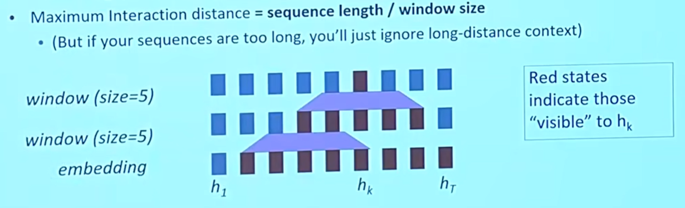

不同于lecture7的Seq2Seq中的Attention，这里展示了一个在单个句子中的attention如下图：从layer0到layer1，所有的embedding都可以并行计算到layer1，所以最大交互距离变成O(1)

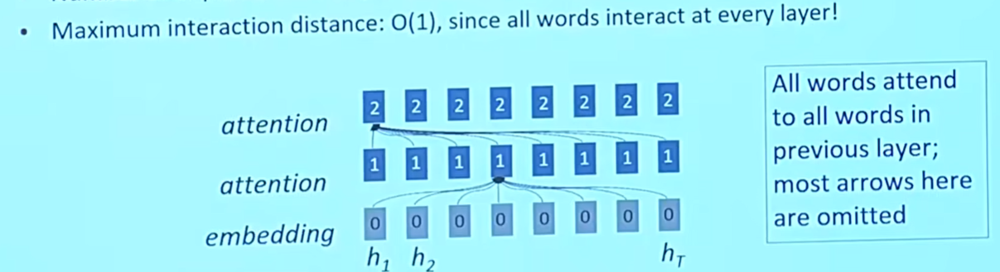

### Self Attention

如果用Self-Attention作为一个NLP构造块如下图：（Self-Attention是一个集合的运算，而不是建立在单个点之上的），那么就无法在其中使用单词间的顺序信息。然而单词间的顺序信息很重要

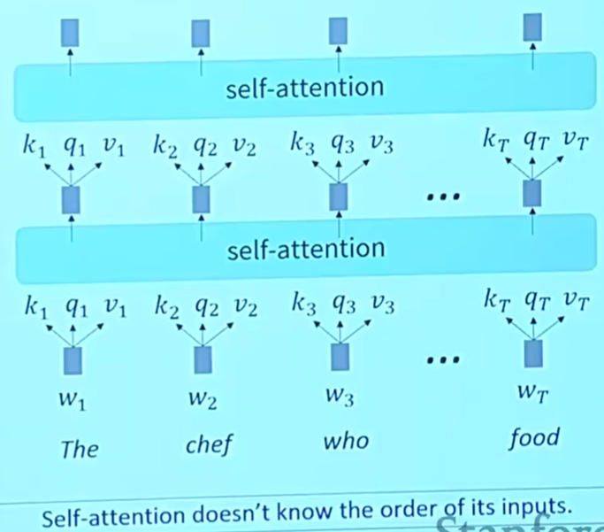

先用一个简单的p~i~来表示每个向量在序列中的位置，然后在embedding层将它处理进无方向的向量q,k,v中

Sinusoidal position representations：

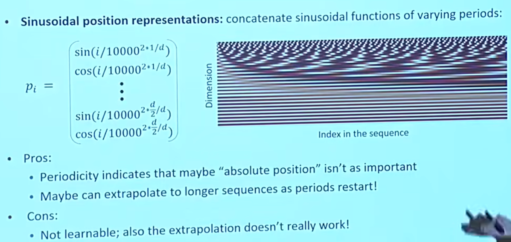

其中，p~i~如下图：

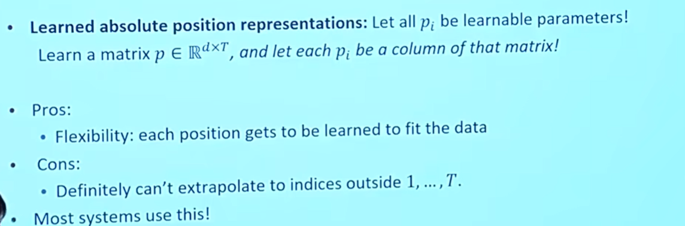

所以，Self-attention作为构造块过程中遇到的一些问题和相应解决方法：

- Q：无法表示位置。A：通过添加位置向量
- Q：线性。A：通过添加feed-forward网络，在其中使用非线性激活函数
- Q：可能会看到未来的信息。A：使用负无穷遮盖当前处理位置后面的内容（通过构造一个下三角是可使用信息，上三角是负无穷的矩阵）

### Transformer

和之前不同的是，这里的q=Qx，k=Kx，v=Vx

所以就有了接下来使用Q,K,V 计算attention的方法：

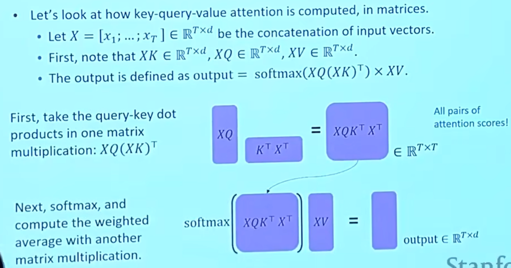

Multi-headed attention：可以用来同时查看不同位置

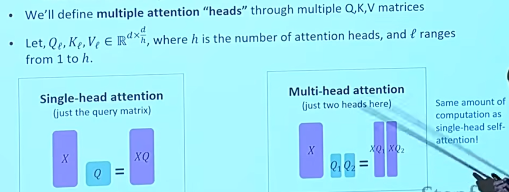

Residual connections：把相邻两层的差别拎出来，方便可视化观察和做梯度下降

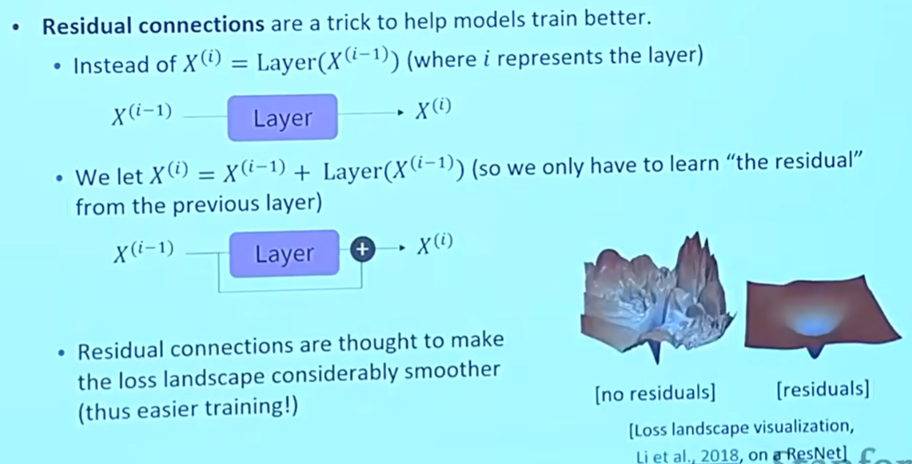

Layer normalization：是一种帮助模型训练得更快的方法。通过将每层中无信息的隐藏向量进行归一化标准化。具体步骤如下图：

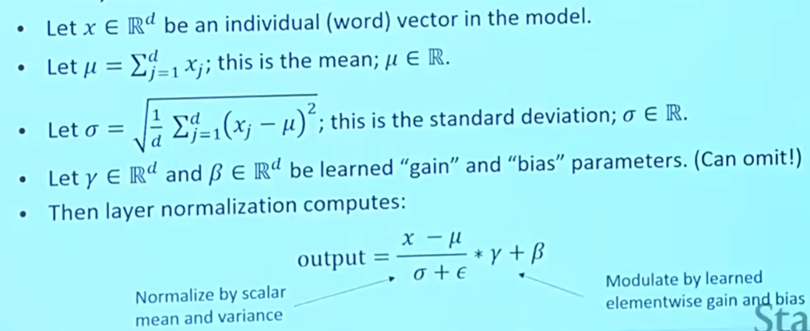

scaled dot product：通过点积的方式，当维度d增大时，点积结果也会增大。因此，在经过softmax函数归一化之后，概率分布会更集中，出现一个更明显的峰值，对应地，其他地方的概率曲线就会变得更加平缓，梯度趋近于零，就不会干扰梯度下降。

同时，通过score除以d/h的方式来控制其本身的值不变。如下图：

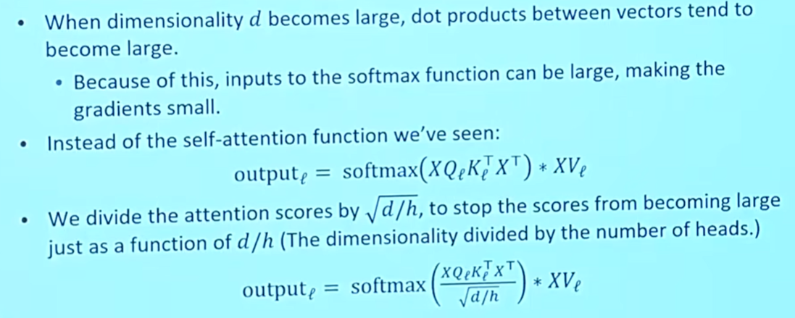

所以经过前面的剖析，再回到Transformer Encoder-Decoder，block中具体流程如下两图：

Encoder：

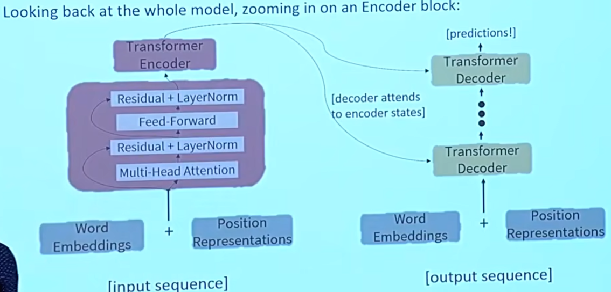

Decoder：

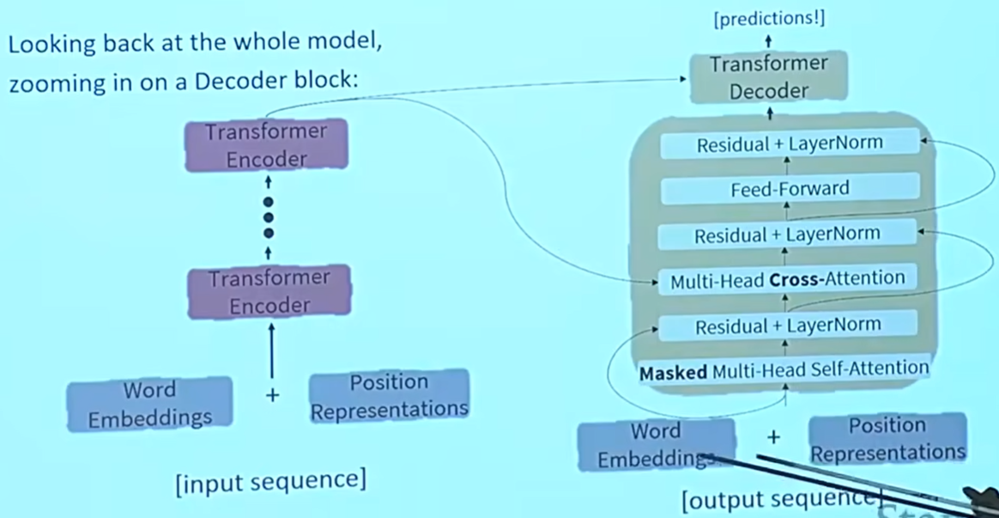

其中，还有一个多头交叉注意力需要补充，如下图：

说明：多头交叉注意力（可以参考上图）其实是encoder的最后一个block的attention与decoder上一个block 的attention进行运算。   而这个运算过程可以抽象为decoder作为索引，到encoder去找到相应的位置，再把encoder这个位置里面的值取出来。     再具体一点，如下图，将H作为encoder的向量连接，将Z作为decoder的向量连接，那么`Z的query`和`H的key`做运算，找到encoder对应的那个位置，然后作为softmax的参数，再与`H的value`进行运算，得到对应的内容。

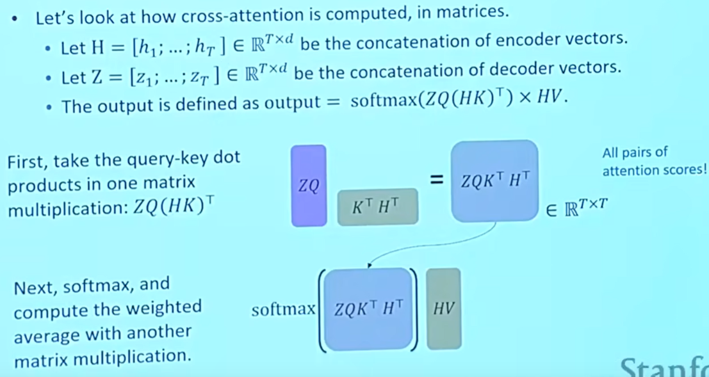